# Ephesoft Configuration Steps

## 1. Prepare and manage batch classes
Please follow these steps for batch class management.
1. Login to [Batch Class Management](http://<host-name>:8080/dcma/BatchClassManagement.html)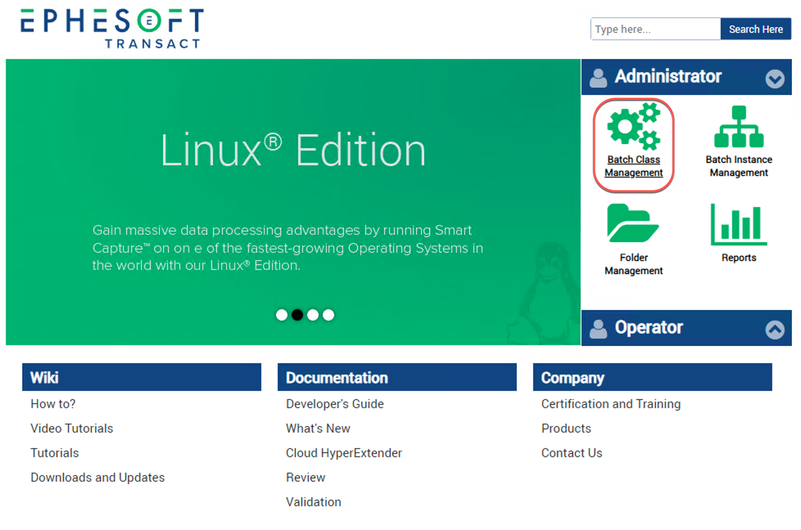
2. Credentials -  `ephesoft/demo`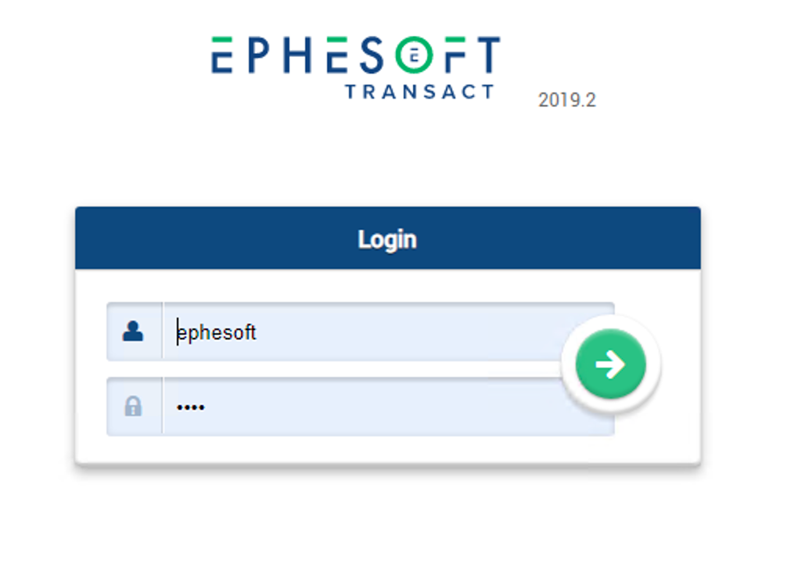
3. Successful login will route to this Batch Class Management screen. Double click the last row, which is the Batch Class created for this tutorial. 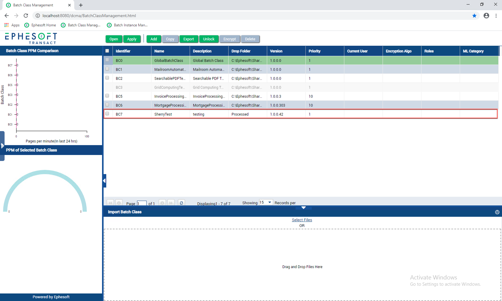
4. Ephesoft has to be trained on the files that are to be OCR-ed. To do this, please upload a sample of the document as shown here.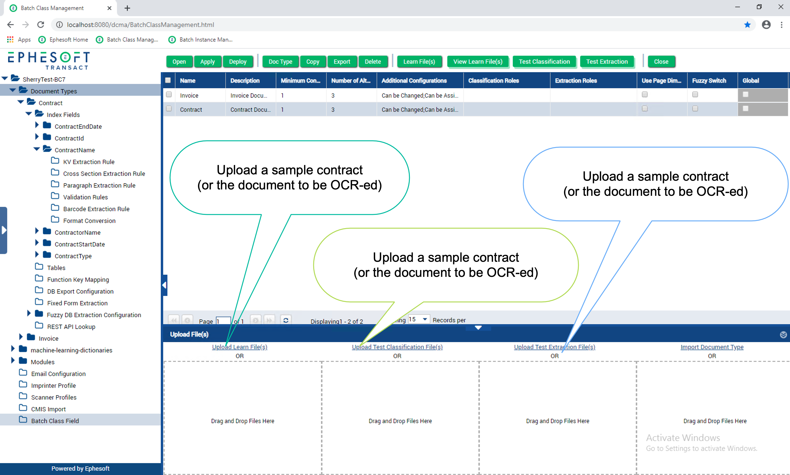
5. The view is updated with more details of the batch. Now the document types configured in this batch to be OCR-ed are available.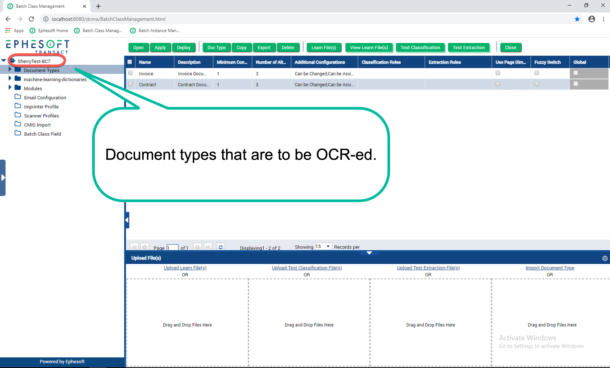
6. Double click on a Document Type to open it.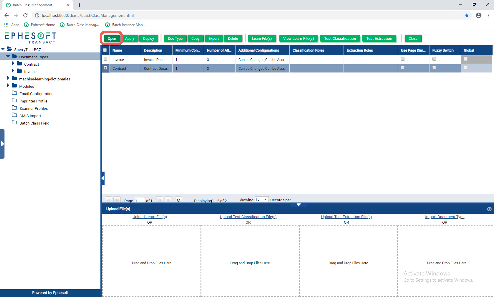
7. Select an Index Type related to a Document Type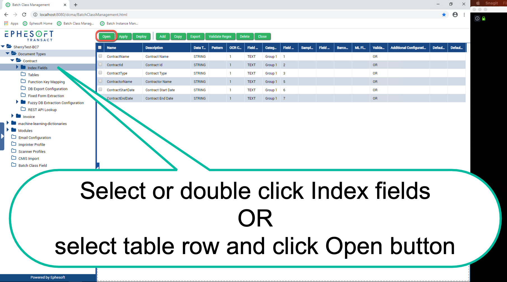
8. Create Key-Value pairs to mention the keys and values to be extracted.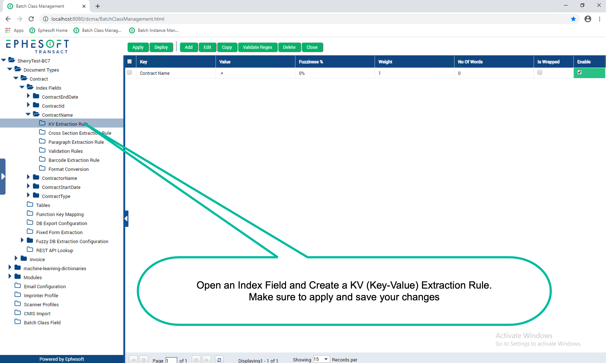
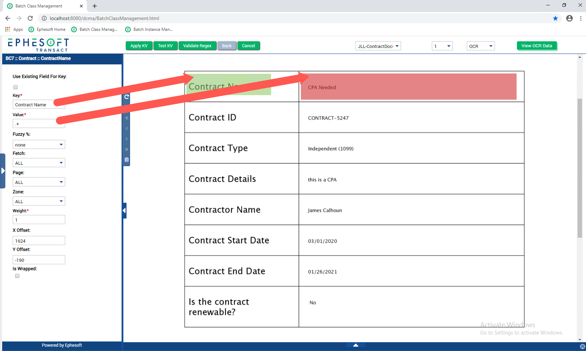
8. Make sure all the changes are saved and deployed by clicking the `Apply` and `Deploy` buttons.
## 2. CMIS Import
1. Make sure the values are entered correctly for importing documents from ACS to Ephesoft.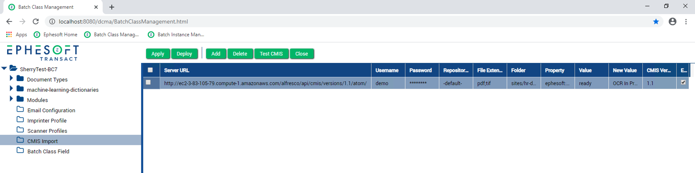
## 3. CMIS Export
1. Make sure the values are entered correctly here for exporting documents from Ephesoft to ACS.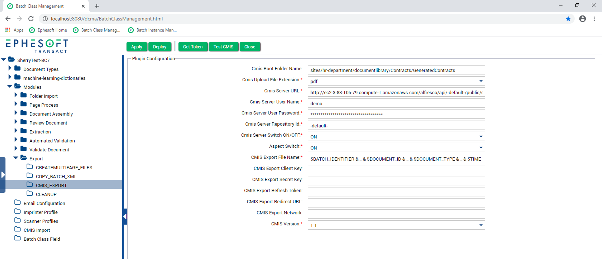
## 4. Updating Document Metadata before exporting
