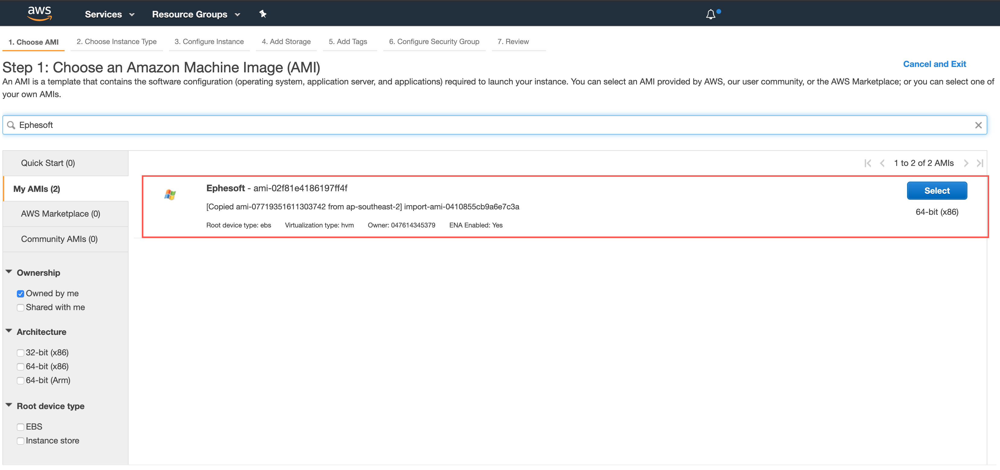
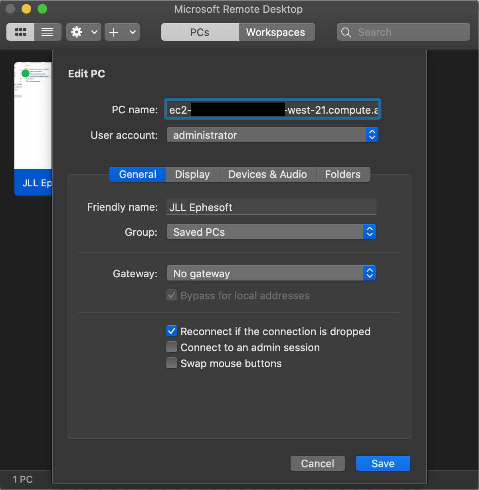
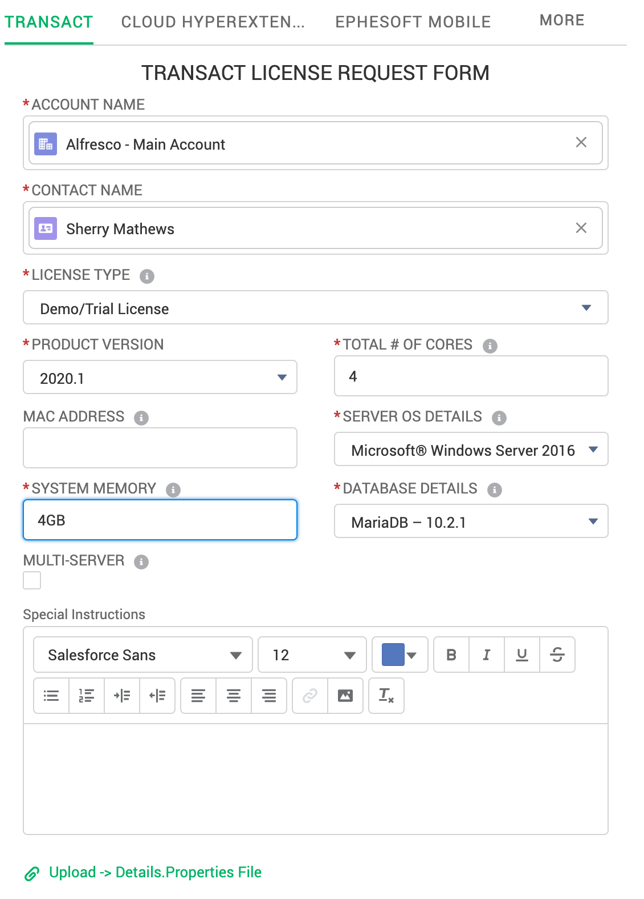

# Ephesoft Installation Steps

## Setup an AWS EC2 Instance using Ephesoft image
1. Select the Ephesoft AMI from the AWS console.
2. Review and Launch an EC2 Instance.
3. Note down the `IP address` of this Ephesoft EC2 Instance.
4. Add it to the Inbound Rules list of the ACS EC2 Instance's Security Group in order to establish the network between EC2 instances that run ACS and Ephesoft.
5. RDP and connect to the Ephesoft instance using `administrator/Ephe$0ft`.
```
P.S : If you are using a Mac, do install Remote Desktop Connection app.
```
6. After successfully RDP-ing to the Ephesoft EC2 Instance, open a `PowerShell` in Administrator mode and run the following command in the Ephesoft EC2 Instance.
```
slmgr -rearm
```
7. Open port `8080` in the Windows Firewall to get access the web UI without doing an RDP, for future.
8. A valid Ephesoft license is required for successful login.

## Steps to get a valid Ephesoft license

1. Send a request to tickets@ephesoft.com to create a Customer Portal account.
2. To submit a new license request, please log in to [License Management page](https://ephesoft.force.com/login?ec=302&startURL=%2Fs%2Flicenses).
```
The 'details.properties' file is available at 'Ephesoft Installation Folder\dependencies\license' directory.
```
3.  Perform the following steps once you receive the valid license `ephesoft.lic` file.
4.  Copy the ephesoft.lic file to the following location: `Ephesoft Installation Folder\dependencies\license-util` directory.
5.  Open the command line by running it as `Administrator` and navigate to the `Ephesoft Installation Folder\dependencies\license-util` directory
6.  Type `install-license.bat` and run it `TWICE`.
7.  Restart the `Ephesoft services` to reset the license details.
8.  Open browser and go to `http://localhost:8080/dcma/` using `ephesoft/demo`.

```
Tip: If you have errors when trying to run Ephesoft, try the following:

Open regedit and set the User permissions to Full Control for the following Key: HKEY_LOCAL_MACHINE\SOFTWARE\JavaSoft\Prefs\com\ephesoft  then Repeat steps 2-3.
Please Re-run the Full.bat file located in the Ephesoft Installation Folder\dependencies\license directory and re-send the details.properties file to licenses@ephesoft.com.

Important: Licenses are based on MAC addresses, any changes to the MAC addresses on the machine require a new license. (The following devices use MAC addresses: NICs, WLAN, VPN, Virtual Network adapters, VM Network adapters and Bluetooth)
```